# Frontend Mentor - Mortgage repayment calculator solution

This is a solution to the [Mortgage repayment calculator challenge on Frontend Mentor](https://www.frontendmentor.io/challenges/mortgage-repayment-calculator-Galx1LXK73). Frontend Mentor challenges help you improve your coding skills by building realistic projects.

## Table of contents

- [Overview](#overview)
  - [The challenge](#the-challenge)
  - [Screenshot](#screenshot)
  - [Links](#links)
- [My process](#my-process)
  - [Built with](#built-with)
  - [What I learned](#what-i-learned)
- [Author](#author)

## Overview

### The challenge

Users should be able to:

- Input mortgage information and see monthly repayment and total repayment amounts after submitting the form
- See form validation messages if any field is incomplete
- Complete the form only using their keyboard
- View the optimal layout for the interface depending on their device's screen size
- See hover and focus states for all interactive elements on the page

### Screenshot

- Desktop Design Completed

  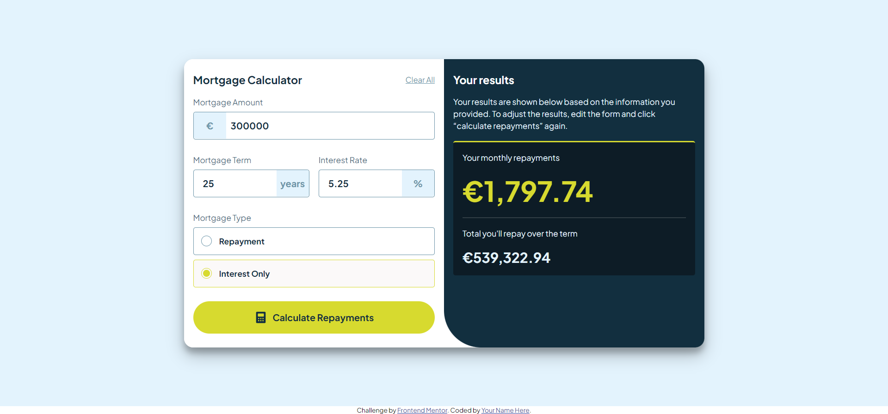

- Desktop Design Empty

  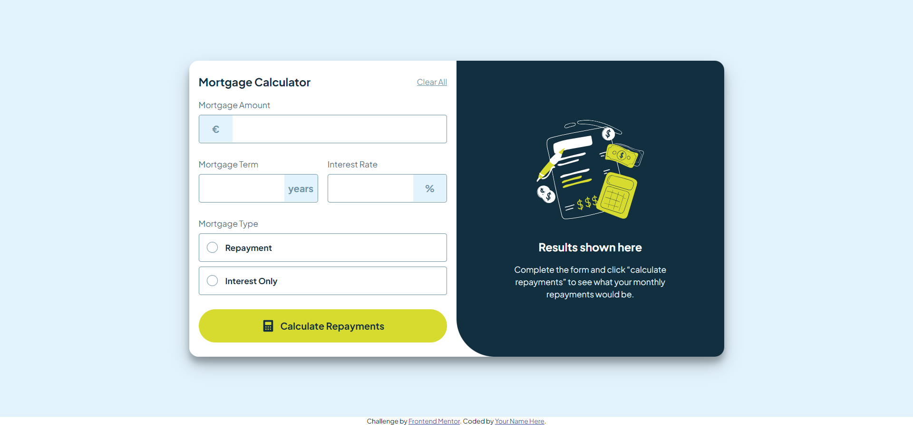

- Tablet Design Completed

  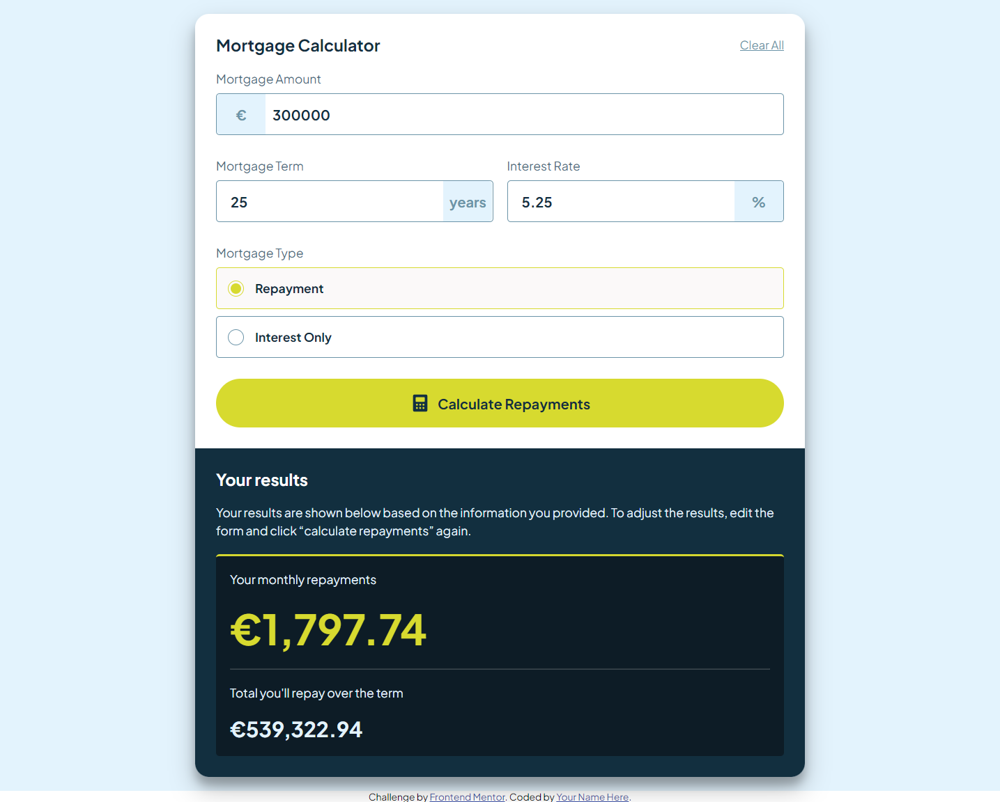

- Tablet Design Empty

  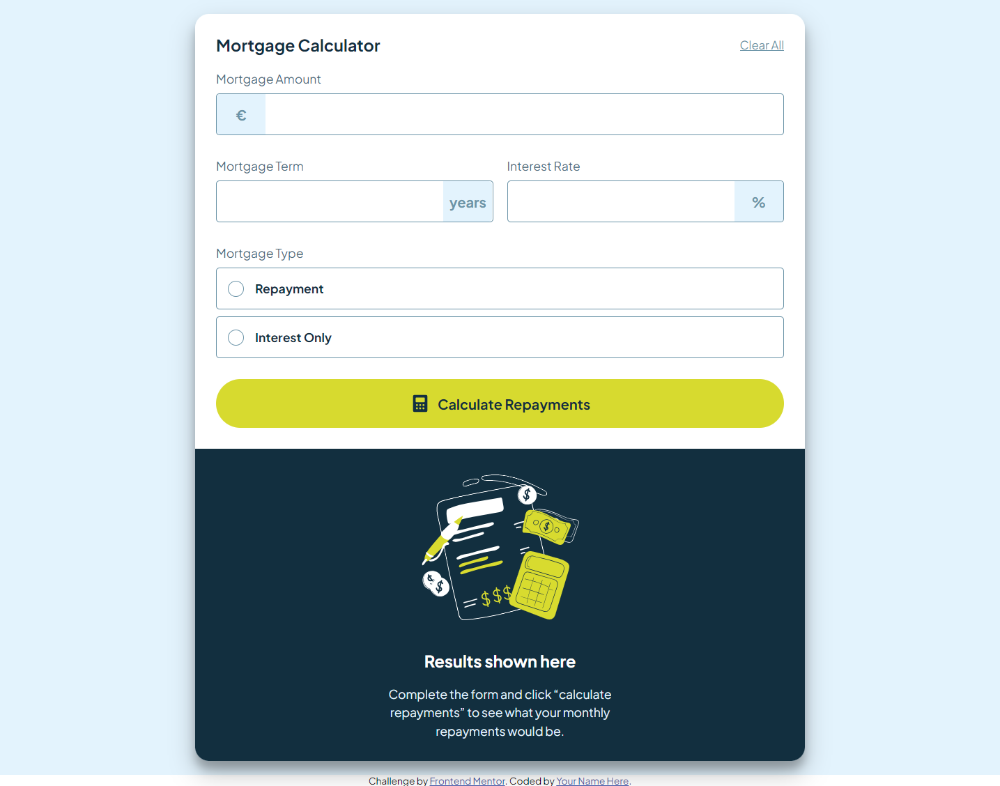

- Mobile Design Completed

  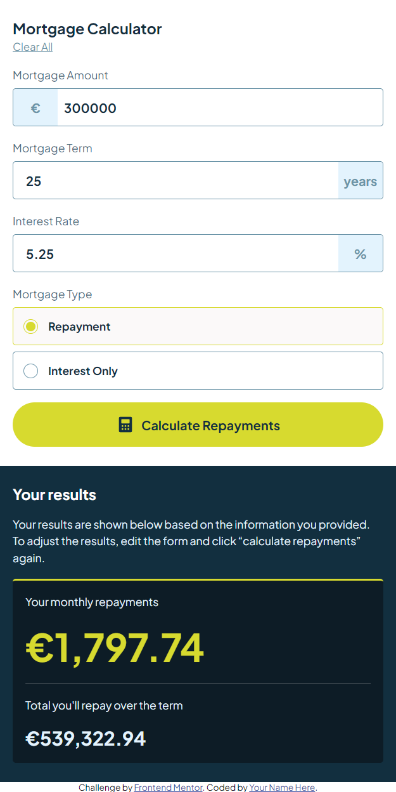

- Mobile Design Empty

  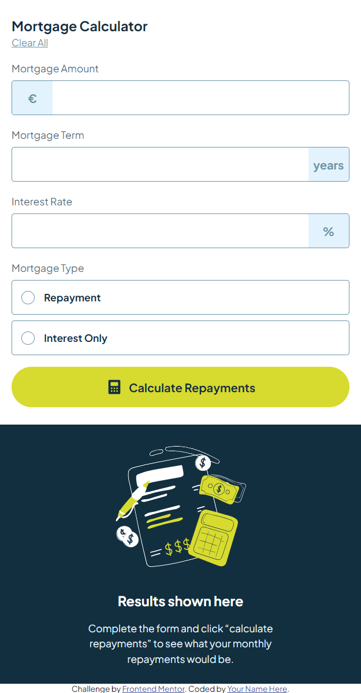

- Active States

  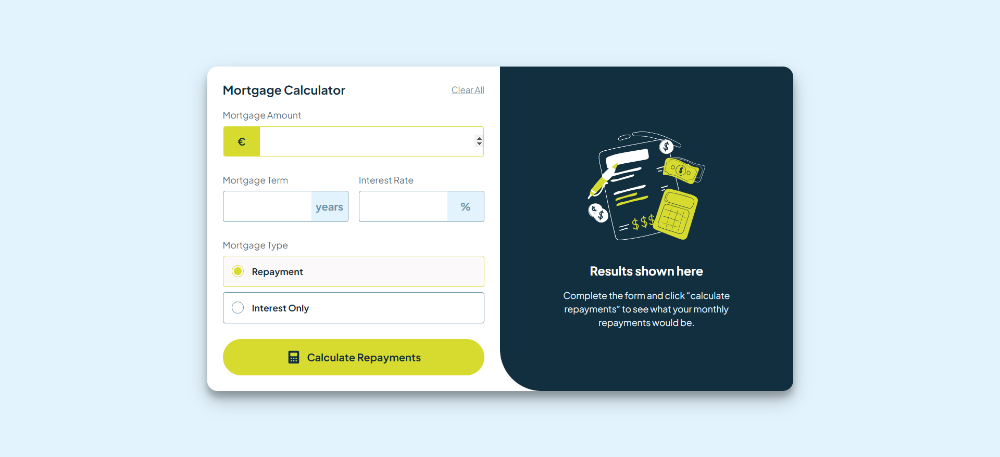

- Error States

  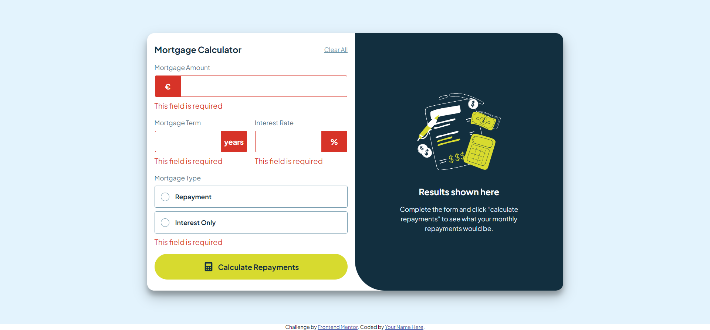

- Hover States

  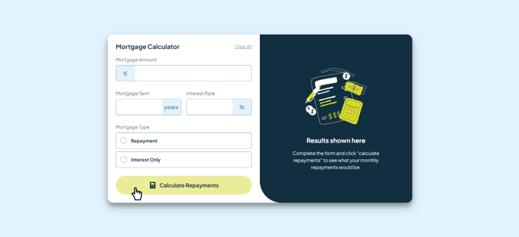
  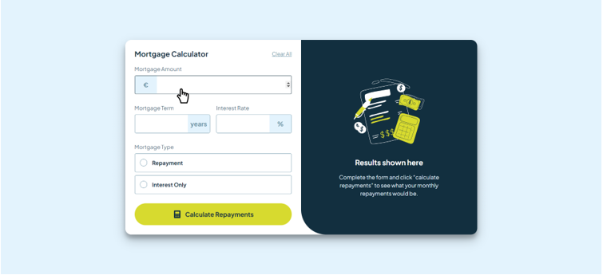
  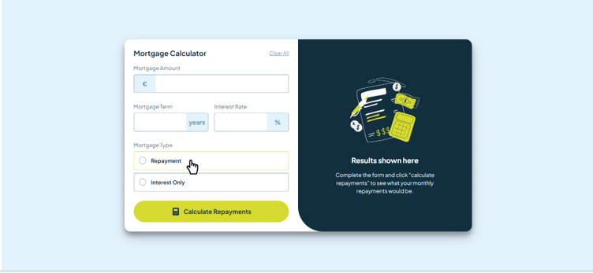

### Links

- Live Site URL: [https://mortgage-calculator-abinandan.netlify.app/]()

## My process

### Built with

- Custom CSS
- Flexbox
- CSS Grid
- Mobile-first workflow (Media Queries)
- Vanilla JavaScript
- FormData API

### What I learned

Since this challenge demanded "units" element for each input element (like Mortgage Amount, etc.), the design of input element was a bit challenging. Below are the images of the input element along with units followed by the css code that I wrote for styling the units.

- Normal Input

  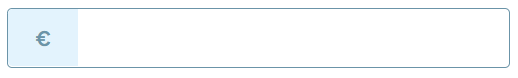

- Error Input

  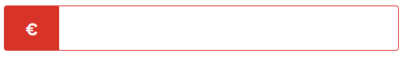

- Active Input

  

```css
.input-container {
  margin: 0.5rem 0;
  position: relative;
  display: flex;
  align-items: center;
}
.form-input:nth-child(2) {
  padding-left: 4rem;
}
.form-input:nth-child(1) {
  padding-left: 1rem;
  padding-right: 4rem;
}
.error-form-input {
  border: none;
  outline: 1px solid var(--red);
  outline-offset: -2px;
}
.form-input:focus + .input-units,
.input-units:has(+ .form-input:focus) {
  background: var(--lime);
  color: var(--slate-900);
}
.input-units {
  display: grid;
  place-items: center;
  position: absolute;
  height: 46px;
  width: 3.5rem;
  background: var(--slate-100);
  border: transparent;
  color: var(--slate-500);
  font-weight: 700;
}
/* UNITS -  ERROR */
.error-units {
  background: var(--red);
  color: var(--white);
}
.input-units:nth-child(1) {
  border-top-left-radius: 0.25rem;
  border-bottom-left-radius: 0.25rem;
  left: 1px;
}
.input-units:nth-child(2) {
  border-top-right-radius: 0.25rem;
  border-bottom-right-radius: 0.25rem;
  right: 1px;
}
```

Adding commas to the amount value was interesting and here is the image and code for that.

- Commas

  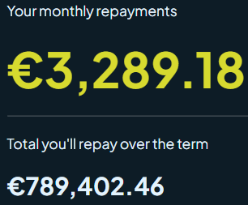

```js
function addCommas(num) {
  let [number, decimal] = `${num}`.split(".");
  let len = number.length;
  while (len - 3 >= 1) {
    len -= 3;
    number =
      number.substring(0, len) + "," + number.substring(len, number.length);
  }
  return decimal ? `${number}.${decimal}` : number;
}
```

If you want more help with writing markdown, we'd recommend checking out [The Markdown Guide](https://www.markdownguide.org/) to learn more.

## Author

- Website - [Abinandan A T](https://my-portfolio-1z8s.onrender.com/)
- Frontend Mentor - [@Abinandan1](https://www.frontendmentor.io/profile/Abinandan1)
